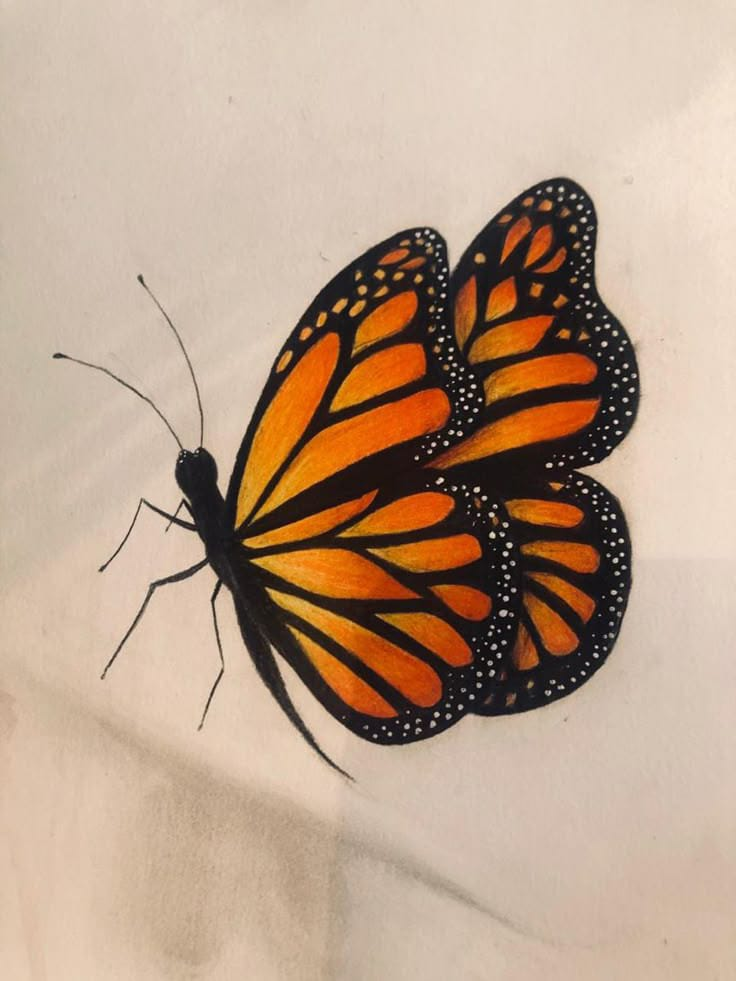
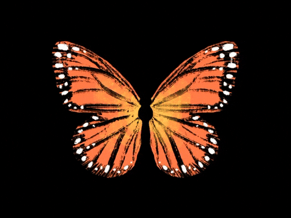

<!DOCTYPE html>
<html lang="en">
<head>
    <link rel="icon" type="image/x-icon" href="icono.jpg">
    <meta charset="UTF-8">
    <meta name="viewport" content="width=device-width, initial-scale=1.0">

</head>
<body>
    

        <h1>Mariposas</h1>
        <h3>¿Qué son?</h3>
    
Las mariposas son insectos con alas de colores brillantes,
    conocidos por su delicadeza y su papel vital en la polinización. 
    Existen miles de especies alrededor del mundo.
    Ciclo de Vida
    las mariposas pasan por cuatro etapas: 
    1.Huevo
    2.Oruga (larva)
    3.Crisálida (pupa)
    4.Adulto (mariposa)

 

 

NOMBRE COMÚN: Mariposa monarca NOMBRE CIENTÍFICO: Danaus plexippus CLASE: Invertebrada ALIMENTACIÓN: Herbívora NOMBRE DEL GRUPO: Nube o caleidoscopio de mariposas PROMEDIO DE VIDA EN LA NATURALEZA: 6 a 8 meses TAMAÑO: Envergadura 9,3 a 10,5 cm PESO: 4, 3 a 11, 7 g

    

    

La mariposa suele representar la belleza, la pureza o la armonía,  pero también el cambio, la transición de algo imperfecto y temporal, hacia algo maravilloso y eterno.  Muchas religiones vieron en el destino de las mariposas un equivalente al destino del alma humana.  Tanto así que los antiguos griegos llamaban a la mariposa psyché,  término también empleado para el alma y para la conciencia.

    <video src="mapvid.mp4" alt="vid">

</body>
</html>  